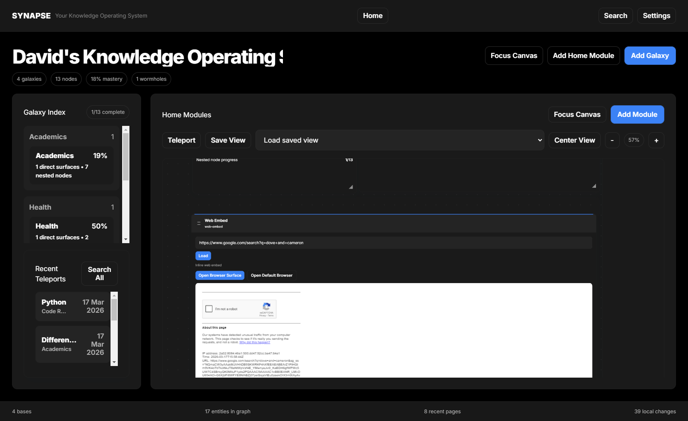
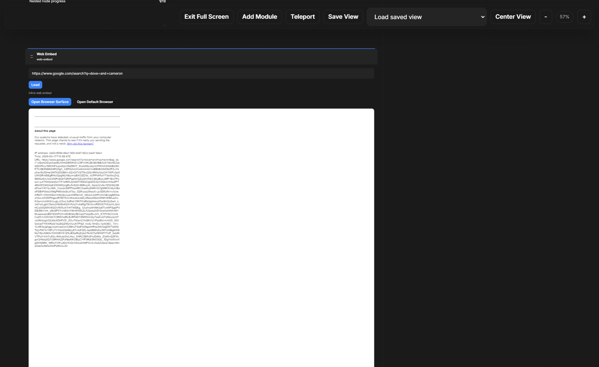
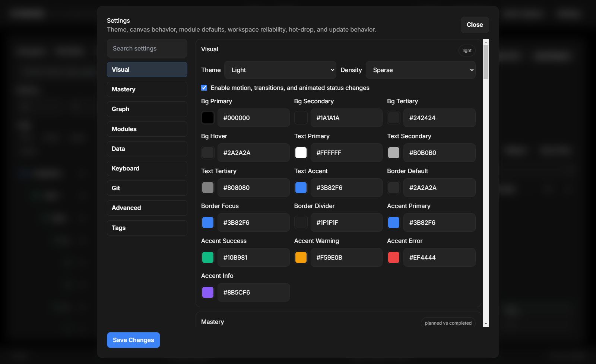

# SYNAPSE

SYNAPSE is a desktop-first, local-first learning operating system for turning course folders into interactive knowledge maps, study workspaces, and launch-ready study tools. It runs fully on-device with Electron, React, TypeScript, Markdown, JSON, file watching, and optional Git-based workspace sync.

## What you get

- Visual base and node navigation
- A module canvas on Home and inside every node
- Study tools for notes, practice, files, analytics, planning, and reference material
- Quick capture for notes, links, files, and screenshots
- Local workspace watching and file-backed modules
- Workspace Reliability controls for Git status, sync, and recovery
- Built-in sample data so you can explore the app immediately

## Screenshots

### Home



### Focused Home Canvas



### Settings / Workspace Reliability



## Quick Start

### 1. Install dependencies

```bash
npm install
```

### 2. Start the development app

```bash
npm run dev
```

### 3. Run the built desktop app

```bash
npm run build
npm run start:built
```

You can also use the helper launcher:

```bash
npm run synapse -- dev
npm run synapse -- build
npm run synapse -- run
npm run synapse -- package
npm run synapse -- test
```

## First Run Walkthrough

### 1. Open the homepage

When SYNAPSE launches, you land on Home. Home is a real working canvas, not just a dashboard. You can:

- inspect your galaxies and recent teleports
- add Home modules
- focus the Home canvas full-screen
- jump into Settings

### 2. Open a galaxy or base

Click a base card from the Home index to open its graph and workspace context. Bases group related nodes and give you a scoped study area.

### 3. Open a node

From the graph or tree, open a node to enter its page workspace. Each node can have its own module canvas, attached files, notes, practice, timelines, and study tools.

### 4. Add modules

Use `Add Module` on the canvas. Modules are persisted with the page layout, so the workspace reopens the way you left it.

Recommended first modules:

- `Markdown Editor`
- `PDF Viewer`
- `Image Gallery`
- `Practice Bank`
- `Checklist`
- `Time Tracker`
- `Formula Vault`

### 5. Save real work

Most modules save into the node folder or into the page config automatically. File-backed modules like editors, viewers, galleries, and study guides write to actual files inside the workspace.

### 6. Capture material quickly

Open Quick Capture with `Ctrl+Shift+Space` to send:

- a note
- a link
- a file
- a screenshot

into the active entity.

## How To Use SYNAPSE

### Home

Home acts like a personal command deck:

- galaxy index on the left
- Home canvas in the center
- recent activity and shortcuts
- focus mode for a cleaner canvas-only view

Use Home modules for high-level planning, cross-base dashboards, links, and scratch workflows.

### Bases and nodes

Every base or node gives you:

- a page header with context and stats
- a module canvas
- attached files
- mastery and practice context
- relationships to prerequisites, unlocks, links, and wormholes

### Module canvas

The canvas is the core interaction model:

- drag modules by the module header
- resize from the lower-right corner
- fullscreen a module when you need focus
- save and restore view state
- use different modules for the same node depending on the job

### File-backed workflows

SYNAPSE works best when modules point at real files:

- `Markdown Viewer` and `Markdown Editor` for `.md`
- `PDF Viewer` for `.pdf`
- `Image Gallery`, `Handwriting Gallery`, `Mood Board`, and `CAD Render Viewer` for folders of images
- `Code Viewer` and `Code Editor` for code files
- `File Browser` and `File Organizer` for attached workspace material

### Trackers and progress tools

Use the study-management modules to structure ongoing work:

- `Practice Bank`
- `Error Log`
- `Checklist`
- `Time Tracker`
- `Goal Tracker`
- `Calendar`
- `Reading List`
- `Habit Tracker`

### Learning and reference tools

Use the deeper module set when you want structured review:

- `Flashcard Deck`
- `Quiz Maker`
- `Definition Cards`
- `Cornell Notes`
- `Citation Manager`
- `Feynman Technique`
- `Formula Vault`
- `Study Guide Generator`

### Creative and visual tools

SYNAPSE also supports visual thinking and annotation:

- `Whiteboard`
- `Screenshot Annotator`
- `Diagram Builder`
- `Mind Map`
- `Concept Map`
- `Color Palette`

## Quick Capture and Hot-Drop

Quick Capture is designed for fast intake while you are studying.

### Quick Capture

- `Ctrl+Shift+Space` opens the capture modal
- choose note, link, file, or screenshot
- save into the currently active entity

### Hot-Drop

You can also route files into the active node through the configured hot-drop folder. This is useful for screenshots, exported notes, and quick document drops during live study sessions.

## Git and Workspace Reliability

SYNAPSE includes a safer Git surface for local workspace reliability.

From Settings you can:

- inspect current branch and tracking branch
- see whether the repo is clean or dirty
- verify whether sync is ready
- pull and push with clearer failure states
- make explicit commits instead of relying on blind sync behavior

This is intentionally positioned as an advanced reliability layer, not as a required everyday workflow.

## Updates

If an update feed is configured, SYNAPSE can report update availability and install flow state. If no feed is configured, the app stays truthful and presents a manual-update state instead of pretending auto-update is active.

Optional environment variable:

```bash
SYNAPSE_UPDATE_URL=https://your-update-feed.example.com
```

## Shortcuts

- `Ctrl+Shift+Space`: Quick Capture
- `Ctrl+K`: Command Palette
- `Ctrl+H`: Go Home
- `Ctrl+S`: Sync current course
- `Ctrl+B`: Toggle filter drawer
- `0`: Zoom graph to fit
- `F`: Toggle focus mode
- `Enter`: Open selected topic
- `Escape`: Close overlays or current focused surface

More details live in [SHORTCUTS.md](./SHORTCUTS.md).

## Common Scripts

```bash
npm run dev
npm run build
npm run start:built
npm run run
npm run lint
npm run test
npm run test:e2e
npm run electron:build
```

## Testing and Smoke Checks

### Unit and type checks

```bash
npm run lint
npm test
```

### Build verification

```bash
npm run build
```

### Electron smoke run

```bash
node output/playwright/electron-smoke.mjs
```

That smoke script refreshes the screenshots under [`output/playwright`](./output/playwright) and verifies the main desktop flows, fullscreen stability, module library scrolling, import modal access, settings access, and runtime error collection.

## Project Structure

- [`src/main`](./src/main): Electron main process, IPC, Git, updates, workspace store
- [`src/renderer`](./src/renderer): React UI, module canvases, pages, styles
- [`src/shared`](./src/shared): shared types, schemas, constants
- [`tests`](./tests): unit and behavior tests
- [`test-data`](./test-data): sample bases and nodes used for exploration
- [`output/playwright`](./output/playwright): Electron smoke artifacts and screenshots

## Troubleshooting

### The app launches but a surface looks empty

Most modules are file-backed. Check whether the module points to a valid file or folder inside the current entity.

### A file-based module does not show content

Use `File Browser` to confirm the file exists where the module expects it. Many modules fall back to a default path if no explicit path is configured.

### Git sync is unavailable

Open Settings and check:

- whether Git is enabled
- whether the workspace is a repo
- whether a remote exists
- whether the branch has an upstream

### External embeds show errors

Some sites block iframe use or rate-limit embedded traffic. In those cases, use the built-in browser surface or open the URL in your default browser.

## Additional Docs

- [USER_GUIDE.md](./USER_GUIDE.md)
- [DEVELOPER_GUIDE.md](./DEVELOPER_GUIDE.md)
- [FILE_STRUCTURE.md](./FILE_STRUCTURE.md)
- [SHORTCUTS.md](./SHORTCUTS.md)

## Current State

This repository includes the live desktop shell, Home canvas, graph navigation, file-backed study modules, analytics, quick capture, Workspace Reliability tooling, and automated smoke artifacts. It is now organized as a real product workflow rather than a loose prototype scaffold.
