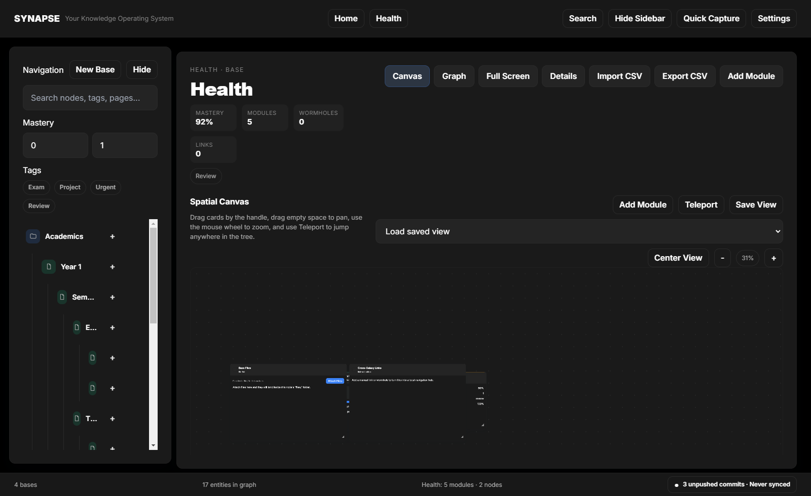

# SYNAPSE

SYNAPSE is a desktop-first, local-first learning operating system for turning folders of notes, files, tasks, and study material into a visual workspace. It combines a graph-driven knowledge map, a freeform module canvas, real file-backed tools, and a production-grade Workspace Reliability suite for Git snapshots, sync, recovery, and dual-device use.

## What SYNAPSE does

- Turns bases and nodes into working study spaces instead of static folders
- Lets you compose each page from modules such as notes, practice banks, galleries, charts, trackers, and references
- Saves work to real files and JSON inside the workspace
- Supports quick capture for notes, links, files, and screenshots
- Includes a safer Git workflow for snapshots, sync, diagnostics, offline retry, and conflict resolution
- Includes a fully indexed Settings Command Center with deep links, live previews, keyboard recording, and power-user runtime controls
- Runs fully on-device with Electron, React, TypeScript, Markdown, JSON, and file watching

## Screenshots

### Home


### Canvas



### Focused Home Canvas


### Settings / Workspace Reliability


### Settings Command Center


## Recommended Repo Layout

SYNAPSE works best when you keep the app source code and the workspace data in separate repositories.

- App code repo: this repository, `synapse`
- Workspace data repo: your notes and files, for example `synapsesync`

Recommended structure:

```text
C:\dev2\synapse                      # Electron app source code
C:\Users\<you>\Documents\SYNAPSE-Workspace   # Actual workspace data repo
```

Why split them:

- app code changes and workspace content changes have different commit histories
- the workspace can sync between desktop and laptop without shipping app source
- recovery is cleaner because Git operations stay scoped to the right data

## Quick Start

### 1. Install dependencies

```bash
npm install
```

### 2. Start the development app

```bash
npm run dev
```

### 3. Build and run the desktop app

```bash
npm run build
npm run start:built
```

### 4. Package the app

```bash
npm run electron:build
```

Helper commands:

```bash
npm run synapse -- dev
npm run synapse -- build
npm run synapse -- run
npm run synapse -- package
npm run synapse -- test
```

## First Run

### 1. Launch SYNAPSE

The app opens into Home. Home is a real working canvas, not a placeholder dashboard.

### 2. Create or connect a real workspace

For a real setup, clone or create a separate workspace repository and point SYNAPSE at that folder via the app config `basePath`.

Typical Windows example:

```bash
git clone https://github.com/davids-labs/synapsesync.git C:\Users\<you>\Documents\SYNAPSE-Workspace
```

Then set `basePath` in the SYNAPSE app config to that folder.

Notes:

- packaged builds typically store config in the Electron user-data directory, such as `%APPDATA%\SYNAPSE\config.json`
- development runs may use Electron's default user-data path instead

### 3. Enable Workspace Reliability

Open `Settings` -> `Git` / `Workspace Reliability` and:

- enable Git integration
- confirm the current branch and remote
- set a device name such as `Desktop PC` or `Laptop`
- choose your conflict strategy defaults

## Core Concepts

### Home

Home is your command deck. Use it for:

- galaxy index
- recent work
- dashboards
- cross-base trackers
- scratch modules
- canvas-only focus mode

### Bases and nodes

A base is a larger domain such as a course or project. A node is a smaller study page inside that base.

Each page can hold:

- a module canvas
- linked files
- notes
- practice and progress data
- links, prerequisites, and wormholes

### Module canvas

The canvas is the main interaction model:

- drag modules around the page
- resize them
- open modules fullscreen
- save and restore layouts
- mix lightweight utilities and deep study tools on the same page

### File-backed workflow

SYNAPSE is strongest when modules point at real files.

Examples:

- `Markdown Editor` and `Markdown Viewer` for `.md`
- `PDF Viewer` for `.pdf`
- `Image Gallery`, `Handwriting Gallery`, `Mood Board`, and `CAD Render Viewer` for image folders
- `Code Viewer` and `Code Editor` for code
- `File Browser` and `File Organizer` for the workspace files attached to a page

See the full module inventory in [`modulelibrary`](./modulelibrary).

## Daily Workflow

### 1. Open a base or node

Click a card from Home or navigate through the tree/graph.

### 2. Add the right modules

Use `Add Module` and pick from the module library.

Good starting modules:

- `Markdown Editor`
- `Practice Bank`
- `Checklist`
- `Time Tracker`
- `Formula Vault`
- `Quick Links`
- `Definition Cards`

### 3. Save real work

Most modules save automatically into the workspace, either in page JSON or in actual files under that node.

### 4. Capture new material

Use Quick Capture to add:

- a note
- a link
- a file
- a screenshot

### 5. Snapshot and sync

Use Workspace Reliability to create a snapshot, sync to remote, inspect repo health, or recover from conflicts.

## Quick Capture and Hot-Drop

### Quick Capture

Use Quick Capture when you want to add something fast without breaking flow.

- shortcut: `Ctrl+Shift+C`
- supports notes, links, files, and screenshots
- saves into the active page

Screenshot capture flow:

1. Open Quick Capture
2. Switch type to `Screenshot`
3. Click `Capture screen`
4. Confirm the preview and filename
5. Save

### Hot-Drop

The app also exposes a hot-drop folder for quick file intake. Drop a file there while a node is active and SYNAPSE routes it into the current workspace target.

## Browser Surface and Web Embeds

SYNAPSE supports two browser-related flows:

- `Web Embed` inside modules
- `Browser Surface` as a top-level browsing window

The app now applies compatibility middleware to embedded content:

- strips `X-Frame-Options`
- strips `frame-ancestors` from CSP
- strips `Cross-Origin-Opener-Policy`
- uses a modern Chrome user agent for windows and requests

This improves compatibility, but some sites still enforce server-side anti-bot checks, rate limits, or login challenges. If an embed still fails, use:

- `Open Browser Surface`
- `Open Default Browser`

## Settings Command Center

Settings is no longer a plain modal of forms. It is a searchable command center for visual tuning, graph behavior, keyboard workflows, Git reliability, runtime controls, privacy posture, and portability.

### What it includes

- global indexed search with `Ctrl+F`
- deep-linkable sections and rows through settings hashes
- breadcrumbs so you always know where you are
- animated section transitions
- per-row reset actions that appear when a value differs from the default
- live mini previews for visual theme and graph settings
- keyboard shortcut recorder inputs instead of plain text entry
- drag-and-drop tag ordering

### Main sections

- `Visual`: theme tokens, surfaces, accents, and live mini-canvas preview
- `Graph`: local preview of node and edge styling
- `Keyboard`: shortcut editing with record-to-bind behavior
- `Workspace Reliability`: Git sync, branches, history, diagnostics, conflicts, reset, backup
- `Lab`: GPU acceleration, embedded DevTools, performance mode, frame-rate controls
- `Privacy & Security`: local-only mode and vault-security controls
- `Export & Portability`: config export, backup targets, and portability helpers
- `Tags`: sortable rendering order for tag presentation

### Deep linking

Each major settings section has a stable deep-link target so search can jump directly to the right control. This makes the Settings surface navigable like a command palette, not just a long scrolling preferences page.

## Workspace Reliability

Workspace Reliability is SYNAPSE's Git and recovery layer. It is explicit on purpose: no silent conflict resolution, no destructive hidden resets, and no fake cloud magic.

### What it includes

- repository health diagnostics
- manual sync
- manual snapshots
- close-time auto-commit
- optional sync prompt on close
- startup pull awareness
- background auto-save snapshots
- offline retry queue
- conflict resolution modal
- external editor diff launch
- branch switching
- recent history timeline with revert actions
- conflict presets
- backup creation
- reset-to-remote escape hatch

### Status bar meanings

The footer sync indicator reflects the current workspace state.

- `Synced`: local and remote are aligned
- `X local changes`: modified files are not committed yet
- `X unpushed commits`: local snapshots exist but are not pushed yet
- `X remote updates available`: pull is needed
- `Queued offline`: sync could not complete because the network was unavailable
- `X sync conflicts`: merge conflicts must be resolved

The queued offline state uses an orange clock indicator in the status bar.

### Snapshot vs Sync vs Backup

- `Commit snapshot`: creates a Git commit without pushing
- `Sync now`: snapshots if needed, fetches, pulls, resolves normal non-conflict flow, then pushes
- `Create manual backup`: creates a local backup copy outside Git

### Branches and history

Workspace Reliability now exposes branch-aware workflows directly in Settings:

- switch branches without leaving the app
- inspect recent commits in a visual timeline
- see device-attributed snapshots and sync events
- revert to a recent commit when you intentionally want to roll the workspace back

Revert is still a serious action. It is safer than a hard reset, but it still changes workspace history and should be used deliberately.

### Close-time behavior

If enabled, SYNAPSE can:

1. auto-commit on close
2. prompt you to sync before quitting
3. keep the app open for review if sync fails

To avoid hanging close flows, close-time auto-commit is capped. If it runs too long, SYNAPSE forces quit rather than leaving a zombie process behind.

### Startup behavior

On launch, Workspace Reliability checks the remote state. If the remote is ahead, the app can:

- prompt you to pull
- auto-pull if you explicitly enabled that behavior
- warn before you keep editing

### Offline retry queue

If a sync fails because the network is unavailable, SYNAPSE:

- keeps your local work intact
- records the failure in diagnostics
- marks the workspace as `Queued offline`
- retries when connectivity returns

This is for resilience, not background auto-push. The app never silently resolves conflicts.

### Conflict resolution

When a pull creates conflicts, SYNAPSE opens a conflict resolver with:

- `Keep All Mine`
- `Keep All Theirs`
- `Smart Merge JSON`
- per-file resolution
- `Open in External Editor`
- `Abort Merge`

Conflict presets let you define your default bias ahead of time:

- `Ask me`
- `Always prefer local`
- `Always prefer remote`

External editor flow:

- prefers `code --diff` when VS Code is installed
- falls back to the system default editor when VS Code is not available

### Diagnostics and reset

Diagnostics show:

- branch and upstream state
- remote reachability
- unpushed commits
- conflicted files
- queued offline state
- human-readable recovery suggestions for Git failures, including repository-level errors such as Git code `128`

`Reset to remote` is destructive. Use it only when you intentionally want to discard local workspace changes.

## Lab

The `Lab` section is for advanced runtime controls that change how the desktop app behaves.

### Current Lab controls

- `GPU acceleration`: persisted at the app level and applied on next launch
- `Embedded DevTools`: enables an in-app inspection workflow for advanced debugging
- `Performance mode`: tunes the UI toward balanced, reduced-motion, or lower-overhead rendering
- `Frame-rate limit`: constrains animation intensity on lower-spec hardware

Notes:

- GPU acceleration changes require an app restart
- performance mode also affects shell-level visual treatment and motion density

## Privacy & Security

SYNAPSE remains local-first, and the Settings Command Center now exposes stronger privacy posture controls.

### Local-only mode

`Local-only mode` is a hard network guardrail. When enabled, SYNAPSE blocks or disables:

- Git sync
- update checks
- browser-surface navigation to remote URLs
- external network-backed requests from the app shell

This is useful for travel, sensitive work sessions, testing, or environments where you want a strict offline posture.

### Vault security

The Command Center includes vault-encryption and master-password-oriented settings so the UX is in place for secured local storage workflows.

Important current limitation:

- the settings and UX are present
- full encrypted-at-rest workspace storage is not yet implemented end to end

Treat this as configuration scaffolding for now, not as a completed zero-trust storage system.

## Export & Portability

SYNAPSE now includes portability tools directly in Settings.

### What you can do

- copy the full current settings configuration as JSON
- create manual backups
- prepare backup target settings for future cloud flows

### Current limitation

Cloud backup providers are represented in the UI and config model, but provider upload pipelines are not yet implemented as full production integrations. Git-backed workspace sync remains the real production sync path.

## Dual-Device Workflow

SYNAPSE is dual-device friendly, but it is still Git-based sync, not realtime CRDT sync.

### Recommended desktop -> laptop flow

1. Work on your desktop
2. Create a snapshot or let close-time auto-commit run
3. Sync before you leave the machine
4. Open SYNAPSE on the laptop
5. Pull the latest workspace changes when prompted
6. Continue working

### Best practice

- sync often
- prefer one active editing device at a time for the same files
- be extra careful with binary files such as images, PDFs, and exports

### If you forget to sync

SYNAPSE will warn when the remote is ahead, and if you go offline during sync it will queue the retry instead of pretending everything is fine.

## Git Setup

### 1. App code repository

This repository is the app source code.

```bash
git clone https://github.com/davids-labs/synapse.git
cd synapse
npm install
```

Use this repo when you are changing:

- Electron code
- React UI
- styles
- modules
- tests
- docs

### 2. Workspace repository

Use a separate repo for the workspace data:

```bash
git clone https://github.com/davids-labs/synapsesync.git C:\Users\<you>\Documents\SYNAPSE-Workspace
```

Use this repo for:

- notes
- page layouts
- module data
- screenshots
- file attachments
- practice and tracker content

### 3. Connect the workspace to SYNAPSE

Point SYNAPSE's `basePath` at your workspace folder, then enable Git integration in Workspace Reliability.

### 4. First sync checklist

- remote configured
- current branch exists
- upstream configured
- workspace opens correctly
- diagnostics show a healthy or understandable state

## Shortcuts

Verified defaults:

- `Ctrl+K`: Command Palette
- `Ctrl+H`: Go Home
- `Ctrl+,`: Open Settings
- `Ctrl+F`: Focus Settings search when Settings is open
- `Ctrl+B`: Toggle Sidebar
- `Ctrl+Shift+C`: Quick Capture
- `Ctrl+Shift+N`: New Node
- `Ctrl+Shift+M`: New Module
- `Ctrl+Shift+S`: Git Sync
- `Ctrl+Shift+I`: Import CSV
- `Ctrl+Shift+E`: Export CSV
- `0`: Zoom To Fit
- `F`: Focus Mode
- `Escape`: Close the current overlay or back out of the active surface

More shortcut details live in [SHORTCUTS.md](./SHORTCUTS.md).

## Useful Scripts

```bash
npm run dev
npm run build
npm run start:built
npm run run
npm run lint
npm run test
npm run test:e2e
npm run electron:build
npm run electron:build:dir
npm run electron:build:win
npm run electron:build:mac
npm run electron:build:linux
```

## Testing and Smoke Verification

### Type check and lint

```bash
npm run lint
```

### Unit tests

```bash
npm test
```

### Production build

```bash
npm run build
```

### Electron smoke run

```bash
node output/playwright/electron-smoke.mjs
```

The smoke script:

- launches the Electron app
- validates the home and canvas shell
- checks fullscreen stability
- checks module-library scrolling
- checks browser-surface launch
- checks settings access
- refreshes screenshots in [`output/playwright`](./output/playwright)
- filters known external challenge noise such as `429` embed chatter so the run stays focused on actual app failures

Most recent full verification pass completed successfully with:

```bash
npm run lint
npm test
npm run build
node output/playwright/electron-smoke.mjs
```

## Project Structure

- [`src/main`](./src/main): Electron main process, IPC, Git manager, updates, workspace store
- [`src/renderer`](./src/renderer): React UI, Home, graph, module canvas, modals, styles
- [`src/shared`](./src/shared): shared types, schemas, constants, API surface
- [`tests`](./tests): unit and behavior tests
- [`output/playwright`](./output/playwright): smoke screenshots and Electron artifacts

## Troubleshooting

### Sync says no remote is configured

Your workspace repo does not have a remote yet. Add one with Git, then reopen or rerun diagnostics.

### Sync is queued offline

The network failed during fetch or push. Your local work is still safe. Wait for connectivity to return or click `Retry queued sync`.

### I hit a conflict

Open the conflict modal from Workspace Reliability, choose a per-file strategy, or open the file in an external editor. Then sync again.

### VS Code diff did not open

SYNAPSE tries `code --diff` first. If the `code` CLI is not installed, it falls back to the system default editor.

### An embed still looks broken

Some sites still block or challenge embedded traffic even after header cleanup. Use Browser Surface or your default browser for those cases.

### Backup failed previously

Manual backups now support whole workspace folders, not just single files. Retry from Workspace Reliability.

### The app opens the wrong workspace

Check the `basePath` in the SYNAPSE app config and make sure it points at your actual workspace repository.

## Additional Docs

- [USER_GUIDE.md](./USER_GUIDE.md)
- [DEVELOPER_GUIDE.md](./DEVELOPER_GUIDE.md)
- [FILE_STRUCTURE.md](./FILE_STRUCTURE.md)
- [SHORTCUTS.md](./SHORTCUTS.md)

## Current State

This repository now contains the live desktop shell, Home canvas, graph navigation, production-ready module surfaces, quick capture, browser surface support, Workspace Reliability with Git sync and recovery, and automated smoke artifacts. SYNAPSE is no longer organized like a loose prototype; it is documented and structured as a real product workflow.

## Build And Deploy Readiness

### Ready now

SYNAPSE is ready to:

- build locally
- package as a desktop app
- run as a serious personal or small-team desktop release
- support a real dual-device Git-backed workspace workflow
- serve as a controlled beta or private production deployment

### Not fully complete for a broad public launch

Before calling this a fully finished mass-distribution product, there are still a few honest gaps:

- `Vault Encryption` is not yet full encrypted-at-rest workspace protection
- cloud backup providers are not yet real provider-backed upload integrations
- packaged auto-update should be validated end to end against a real update feed and installer pipeline
- final signing, installer polish, and platform-distribution hardening should be completed for Windows and any other target platforms
- web embeds are much more compatible now, but hostile sites can still break because of server-side anti-bot controls outside the app's control

### Practical recommendation

If your goal is:

- `build and use it yourself`: yes
- `use it across desktop and laptop with Git-backed workspace sync`: yes
- `share it with a few trusted users as a beta`: yes
- `ship it broadly as a polished public desktop product`: almost, but do one final release-hardening pass around update delivery, signing, and the unfinished security/backup promises first

## Updating The App

For your personal setup, updating SYNAPSE should not wipe your data if you keep the app install and the workspace separated.

### What gets replaced during an update

- the installed app binaries
- packaged frontend and Electron code
- installer-level program files

### What stays safe

- your workspace folder and workspace Git repo
- your notes, files, screenshots, module data, and layouts
- your app config under `%APPDATA%\\SYNAPSE\\`
- your workspace reliability history and Git state

### Recommended update flow

1. Create a workspace snapshot in `Workspace Reliability`
2. Sync the workspace if you want off-machine backup before updating
3. Build a new installer
4. Run the new installer over the existing SYNAPSE install
5. Reopen the app and confirm the workspace path is still correct

### Best-practice setup

Keep these separate:

- app code repo: [c:\dev2\synapse](/c:/dev2/synapse)
- installed app: `C:\Program Files\SYNAPSE`
- workspace data repo: your real workspace folder, for example `C:\Users\<you>\Documents\SYNAPSE-Workspace`

### Important note

Do not treat the install folder as a data folder. The installer can replace app files, but it should not touch your external workspace repository or your `%APPDATA%` config. If you want maximum safety before a new install, create both:

- a Git snapshot
- a manual backup from `Workspace Reliability`
